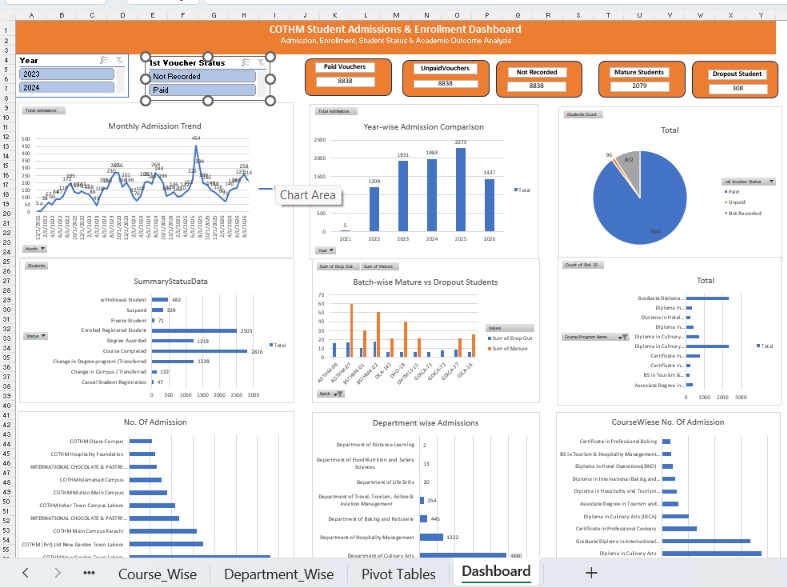

# 📊 Student Admissions & Enrollment Analysis – Excel

An interactive **Excel-based Student Admissions & Enrollment Analysis Dashboard** developed to analyze student admissions, enrollment patterns, academic outcomes, voucher status, and institutional performance across campuses, departments, and academic programs.

The project transforms student admission and enrollment reports into structured **Excel Tables, PivotTables, KPI cards, slicers, and interactive visualizations**, providing management with a clear overview of student trends and performance.

> **Note:** The original dataset contains confidential student information. Therefore, raw student-level data is **not included** in this public repository. Only the dashboard and non-sensitive analytical outputs are shared for portfolio demonstration purposes.

---

## 📸 Dashboard Preview



---

## 🎯 Project Objectives

The main objective of this project is to convert student admission and enrollment records into a structured reporting solution that can help management:

- Monitor overall student admissions
- Analyze monthly and yearly admission trends
- Compare admissions across campuses
- Identify high-enrollment courses and programs
- Analyze department-wise admissions
- Monitor student academic/status outcomes
- Track first-voucher payment status
- Compare mature and dropout students
- Filter and explore results interactively
- Support data-driven academic and administrative decisions

---

## 📂 Data Sources

The analysis was developed using multiple institutional student reports, including:

- New Admission Report with Fee Status
- Student Status Wise Listing
- Student Summary Status Wise
- Student Enrollment Campus Wise
- Student Enrollment Course/Program Wise
- Student Enrollment Department Wise

These reports were consolidated and transformed into structured Excel tables for analysis.

---

## 🔐 Data Privacy

The source reports contain confidential student information such as:

- Student names
- Registration numbers
- CNIC information
- Contact numbers
- Email addresses
- Mailing addresses
- Admission and academic information

For privacy and confidentiality reasons, the **raw source sheets and student-level datasets are not published in this repository**.

The repository is intended to demonstrate the **reporting methodology, dashboard design, PivotTable analysis, KPI development, and Excel visualization skills** used in the project.

---

## 📊 Dataset Overview

The detailed admissions dataset used for the dashboard contains approximately:

| Metric | Value |
|---|---:|
| Detailed Admission Records | 8,838 |
| Campuses in Campus Report | 44 |
| Courses / Programs | 38 |
| Departments | 7 |
| Analysis Period | 2021–2026 |

> Different institutional reports may cover different reporting populations and scopes. Therefore, totals from separate portal reports are not assumed to be directly comparable unless they represent the same reporting population.

---

## 🧹 Data Preparation

Before building the analysis, the source data was cleaned and transformed in Excel.

### Admission Date Cleaning

The original admission date field was converted from text into a valid Excel date using:

```excel
=DATEVALUE([@[Admission Date]])
```

A separate **Clean Admission Date** field was created for time-based analysis.

### Month

```excel
=DATE(
    YEAR([@[Clean Admission Date]]),
    MONTH([@[Clean Admission Date]]),
    1
)
```

The field was formatted as:

```text
mmm-yyyy
```

### Year

```excel
=YEAR([@[Clean Admission Date]])
```

### Week Number

```excel
=WEEKNUM([@[Clean Admission Date]],2)
```

These helper fields allow admissions to be analyzed at **monthly, yearly, and weekly levels**.

---

## 🧱 Excel Data Model Structure

The workbook uses multiple structured Excel Tables for different reporting areas.

| Excel Table | Purpose |
|---|---|
| `AdmissionsData` | Detailed admission and first-voucher analysis |
| `StatusData` | Student status analysis |
| `SummaryStatusData` | Mature and dropout outcome analysis |
| `CampusData` | Campus-level enrollment analysis |
| `CourseData` | Course/program-level enrollment analysis |
| `DepartmentData` | Department-level enrollment analysis |

Separating these reporting areas makes the workbook easier to maintain and allows PivotTables to be built according to the scope of each source report.

---

## 📌 Key Performance Indicators

The dashboard contains KPI cards for important student and payment metrics.

### Total Admissions

Displays the number of student admission records available within the detailed admissions dataset.

### Paid Vouchers

Tracks students whose first voucher status is recorded as **Paid**.

### Unpaid Vouchers

Shows students whose first voucher remains **Unpaid**.

### Voucher Status Not Recorded

Identifies admission records where first-voucher information was not available and was standardized as:

```text
Not Recorded
```

### Mature Students

Displays the total number of students categorized as **Mature** in the Student Summary Status report.

### Dropout Students

Displays the total number of students categorized as **Drop Out** in the Student Summary Status report.

---

## 📈 Dashboard Visualizations

The analysis includes multiple PivotTable-based visualizations.

### 1. Monthly Admission Trend

**Chart:** Line Chart with Markers

Tracks changes in student admissions over time and highlights monthly admission patterns.

---

### 2. Year-wise Admission Comparison

**Chart:** Clustered Column Chart

Compares total student admissions across different years.

---

### 3. Student Status Distribution

**Chart:** Clustered Bar Chart

Analyzes students across different status categories such as:

- Enrolled Registered Student
- Course Completed
- Degree Awarded
- Withdrawal Student
- Freeze Student
- Suspend
- Cancel Student Registration
- Campus/Program changes

---

### 4. Batch-wise Mature vs Dropout Students

**Chart:** Clustered Column Chart

Compares **Mature** and **Drop Out** students across batches.

A **Top 10 filter based on dropout count** is used to keep the visualization readable and highlight batches requiring closer attention.

---

### 5. First Voucher Status Distribution

**Chart:** Pie Chart

Shows the distribution of first-voucher records across:

- Paid
- Unpaid
- Not Recorded

This provides a quick overview of first-voucher payment status.

---

### 6. Top Programs by Admissions

**Chart:** Clustered Bar Chart

Highlights the programs receiving the highest number of student admissions.

---

### 7. Department-wise Admissions

**Chart:** Clustered Bar Chart

Compares admission volume across academic departments.

---

### 8. Top Campuses by Admissions

**Chart:** Clustered Bar Chart

Uses the campus-wise enrollment report to identify campuses with the highest admission volume.

---

### 9. Course/Program-wise Enrollment

**Chart:** Clustered Bar Chart

Uses the aggregated course/program report to compare enrollment across academic programs.

---

## 🎛️ Interactive Filtering

The dashboard is designed to support interactive filtering through **Excel Slicers**.

Slicers can be connected to compatible PivotTables that share the same underlying data source/Pivot Cache.

For example, filters based on the detailed admissions dataset can be used to interactively analyze:

- Year
- Voucher Status
- Campus
- Department
- Course / Program

KPI cards can also be linked to PivotTable result cells so that their displayed values update automatically when the connected PivotTables are filtered.

> PivotTables created from different source tables cannot automatically share the same slicer unless the tables are integrated through an appropriate Excel Data Model/relationship structure.

---

## 📊 PivotTable Analysis

PivotTables are used as the analytical layer between the raw reports and dashboard.

Examples include:

```text
Month
   ↓
Count of Student ID
```

```text
Year
   ↓
Count of Student ID
```

```text
Student Status
   ↓
Count of Student ID
```

```text
Batch
   ↓
Sum of Mature
Sum of Drop Out
```

```text
Voucher Status
   ↓
Count of Student ID
```

```text
Course / Program
   ↓
Count of Student ID
```

This structure allows the dashboard to remain dynamic while avoiding hard-coded analytical results.

---

## 📁 Workbook Structure

The working Excel solution is organized into dedicated data, analysis, and presentation sheets.

```text
Student_Comparison_Report
│
├── Raw_Admissions
├── Raw_Status
├── Summary_Status
├── Campus_Wise
├── Course_Wise
├── Department_Wise
├── Comparison
└── Dashboard
```

### Raw / Source Sheets

Contain imported and structured data used for analysis.

### Comparison / Pivot Analysis

Contains PivotTables and supporting analysis used to generate dashboard visuals and KPI values.

### Dashboard

Provides the final management-facing interface containing:

- KPI cards
- Slicers
- Trend analysis
- Status analysis
- Payment analysis
- Academic outcome analysis
- Campus, department, and program comparisons

---

## 🛠️ Tools & Techniques Used

The project demonstrates practical use of:

- Microsoft Excel
- Excel Tables
- PivotTables
- PivotCharts
- Slicers
- Structured References
- Date Cleaning
- Data Standardization
- `COUNTIF`
- `COUNTA`
- `DATEVALUE`
- `YEAR`
- `MONTH`
- `WEEKNUM`
- Top-N Analysis
- KPI Design
- Dashboard Layout & Formatting
- Interactive Reporting
- Data Validation and Quality Checking

---

## 💡 Key Analytical Areas

The dashboard enables analysis across four major areas:

### Admissions Analysis
Understand how admissions change over time and identify important monthly and yearly patterns.

### Academic Outcome Analysis
Monitor student status, maturity, dropout, withdrawal, suspension, and other academic outcomes.

### Financial Status Analysis
Track first-voucher payment status and identify records where payment information is unavailable.

### Institutional Performance Analysis
Compare campuses, departments, courses, programs, and batches to identify enrollment concentration and performance patterns.

---

## ⚠️ Reporting Considerations

Some source reports originate from different modules of the institutional student portal and may use different reporting criteria.

For example, the campus-wise report may represent a broader institutional population than the detailed admission report.

Therefore:

- Report totals should be interpreted within their respective reporting scope.
- Aggregated reports should not automatically be reconciled with detailed reports.
- Differences in totals do not necessarily indicate data-quality issues.
- Cross-report comparisons should only be performed after confirming that reporting definitions and populations are consistent.

---

## 🚀 Future Improvements

Potential enhancements to the project include:

- Integrating source tables through the Excel Data Model
- Creating relationships between admission and status datasets
- Developing slicers that control multiple related reporting areas
- Adding admission growth KPIs
- Adding year-over-year comparisons
- Adding dropout-rate analysis
- Adding campus-level drill-down reporting
- Automating source-data preparation using Power Query
- Migrating the reporting model to Power BI for more advanced interactive analytics

---

## 📁 Repository Structure

```text
student-admissions-enrollment-analysis-excel/
│
├── Dashboard/
│   └── Dashboard.jpg
│
├── PivotTables/
│   └── [Non-confidential analytical outputs]
│
└── README.md
```

> Confidential raw student data is intentionally excluded from the repository.

---

## 👨‍💻 Author

**Muhammad Jamal**  
Data Science Graduate | Data Analytics & Business Intelligence

This project was developed as a practical Excel reporting solution for analyzing student admissions, enrollment, payment status, and academic outcomes while maintaining the confidentiality of student-level information.

---

## 📌 Disclaimer

This repository is shared for **portfolio and educational demonstration purposes**.

The underlying institutional student data is confidential and is therefore not publicly distributed. Dashboard screenshots and analytical outputs have been shared only where they do not expose personally identifiable student information.
